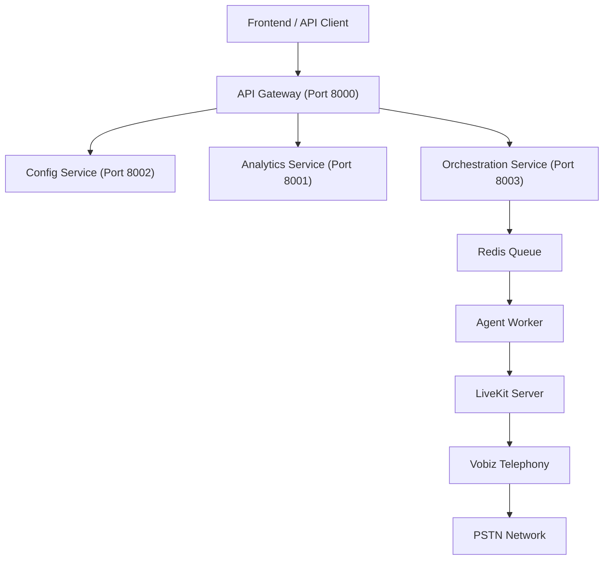

# Open Source Voice Agent Platform

**The complete, production-ready platform for building, deploying, and managing Voice AI Agents.**  
_Built on [LiveKit](https://livekit.io/) (Real-time WebRTC) and [Vobiz](https://vobiz.ai/) (Telephony/SIP)._

> 🚀 **An Open Source Alternative to Vapi, Retell AI, and Bland AI.**

This platform provides everything you need to build scalable, low-latency voice agents that can handle inbound and outbound calls, manage campaigns, and provide detailed analytics—all in your own infrastructure.

---

## 🌟 Why This Platform?

Unlike proprietary APIs that lock you in, this **Open Source Voice Agent Platform** gives you full control:

*   **⚡ Low Latency**: Powered by LiveKit's Real-time Transport for instant voice response.
*   **📞 Telephony Integration**: Seamless SIP trunking via **Vobiz** for reliable inbound/outbound calls.
*   **🤖 Multi-LLM Support**: Bring your own models (OpenAI, Deepgram, Azure, Groq).
*   **📡 Microservices Architecture**: fully modular backend for infinite scalability.
*   **📊 Comprehensive Analytics**: Built-in call recording, cost tracking, and sentiment analysis.
*   **🛠️ Developer First**: Complete API, Webhooks, and easy-to-use React frontend.

---

## 🏗️ Architecture

The platform is designed as a modern microservices system:



### Core Services
1.  **Gateway Service**: Unified API entry point (Auth, Routing).
2.  **Config Service**: Manages Assistants, Phone Numbers, SIP Trunks, and Tools.
3.  **Analytics Service**: Handles Call Logs, Recordings (S3), and Analysis.
4.  **Orchestration Service**: Manages Outbound Campaigns and Job Queues.
5.  **Agent Worker**: Python worker running the actual Voice AI logic (LiveKit Agents).

---

## ⚡ Quick Start

Get the entire platform running in minutes using Docker.

### Prerequisites
*   Docker & Docker Compose
*   **Vobiz Account** (for SIP Telephony)
*   **LiveKit Cloud/Self-hosted**
*   **OpenAI/Deepgram API Keys**

### 1. Clone & Configure
```bash
git clone https://github.com/Piyush-sahoo/Voice-AI-Platform.git
cd Voice-AI-Platform

# Configure backend environment
# Copy example env and fill in your keys
cp backend/.env.example backend/.env.local
```

### 2. Run with Docker Compose
```bash
docker-compose up -d --build
```
This launches:
*   **Frontend Dashboard**: `http://localhost:3000`
*   **API Gateway**: `http://localhost:8000`
*   **Agent Worker**: Connected to LiveKit
*   **Redis & MongoDB**: Infrastructure

---

## 📚 API Documentation

We follow an API-first design. A complete Postman collection is available for testing:
📂 **[`postman/postman_collection.json`](./postman/postman_collection.json)**

### Key Endpoint Areas
*   `POST /api/auth/login` - JWT Authentication
*   `POST /api/assistants` - Create/Manage AI Personas
*   `POST /api/calls` - Trigger Outbound Calls
*   `GET /api/analytics/calls` - Retrieve Call Logs & Recordings
*   `POST /api/campaigns` - Launch Bulk Call Blasts

---

## 🧪 Automated Testing

We include comprehensive scripts to verify your deployment:

1.  **Full Automation Test**: Creates agents, numbers, and makes real calls.
    ```bash
    python scripts/full_api_automation.py
    ```
2.  **API Key Auth Test**: Verifies security and programmatic access.
    ```bash
    python scripts/test_api_key_auth.py
    ```

---

## 📂 Project Structure

```
├── backend/                  # Microservices Backend
│   ├── gateway/             # API Gateway (FastAPI)
│   ├── services/            # Microservices (Config, Analytics, Orchestration)
│   └── shared/              # Shared Libs (Db, Auth, Settings)
├── frontend/                 # React/Next.js Dashboard
├── scripts/                  # Automation & Testing Scripts
├── postman/                  # API Collections
└── docker-compose.yml        # Infrastructure Definition
```

---

## 🤝 How to Contribute

We welcome contributions! Please see our **[Contribution Guidelines](CONTRIBUTING.md)** for a step-by-step guide on how to:

-   Fork and Clone the repo
-   Set up your development environment
-   Create a Pull Request (PR)
-   Follow our coding standards

### Join the Community
*   **Issues**: Submit bugs/feature requests on GitHub.
*   **Discussions**: Ask questions and share ideas.

**Built with ❤️ using [LiveKit](https://livekit.io) and [Vobiz](https://vobiz.ai).**
