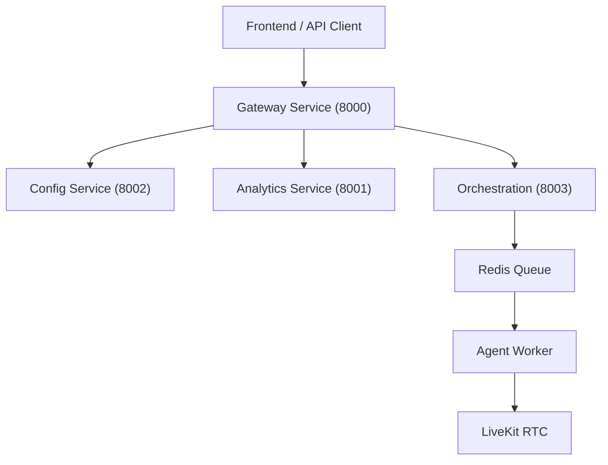

# System Architecture

The Open Source Voice Agent Platform is built as a modular microservices system to ensure scalability, maintainability, and fault tolerance.

## High Level Overview

## Core Services

### 1. Gateway Service (Port 8000)
- **Role**: The entry point for all API requests.
- **Functions**:
  - Authentication (JWT)
  - Request Routing / Proxying
  - Rate Limiting
  - Unified OpenAPI Documentation
- **Stack**: Python, FastAPI

### 2. Config Service (Port 8002)
- **Role**: Manages static configuration and resources.
- **Resources**:
  - Assistants (Prompts, Voices)
  - Phone Numbers
  - SIP Trunks
  - Tools (Function calling definitions)
- **Storage**: MongoDB, Redis (Cache)

### 3. Analytics Service (Port 8001)
- **Role**: Handles data ingestion and retrospective analysis.
- **Functions**:
  - Logging Call Events (Webhooks)
  - Storing Recordings (S3 Presigned URLs)
  - LLM-based Sentiment Analysis
- **storage**: MongoDB (TimeSeries data)

### 4. Orchestration Service (Port 8003)
- **Role**: Manages active tasks and campaigns.
- **Functions**:
  - Outbound Campaign execution
  - Batch job scheduling
  - Task Queue management
- **Stack**: Python, Celery, Redis

### 5. Agent Worker
- **Role**: The "Brain" of the real-time interaction.
- **Functions**:
  - Connects to LiveKit Rooms
  - Handles VAD (Voice Activity Detection)
  - STT / LLM / TTS pipeline execution
  - Function calling execution
- **Scaling**: Horizontally scalable (run multiple workers for high concurrency)

## LiveKit Integration
We use LiveKit for the media transport layer.
- **SIP Interface**: Vobiz sends SIP calls to LiveKit SIP Ingress.
- **Room**: LiveKit converts SIP media to a WebRTC Room.
- **Participant**: The Agent Worker joins the room as a participant to talk.
