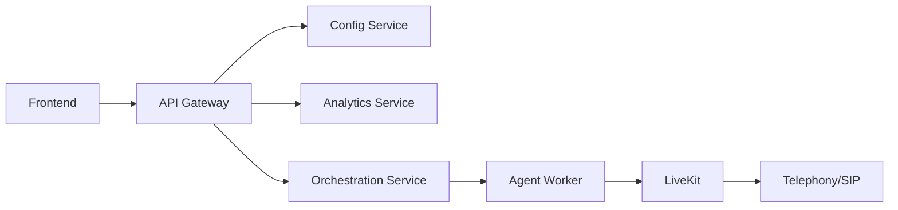

# Introduction

Welcome to the **Open Source Voice Agent Platform** documentation!

This platform provides everything you need to build, deploy, and manage production-ready voice AI agents. It's an open-source alternative to proprietary solutions like Vapi and Retell AI.

## 🚀 What Can You Build?

- **Conversational Voice Agents** - Natural, low-latency conversations powered by LiveKit
- **Outbound Call Campaigns** - Automate bulk calling with intelligent routing
- **Inbound Call Handling** - Route and manage incoming calls via SIP
- **Voice Analytics** - Deep insights with call recording and sentiment analysis

## 🏗️ Architecture

The platform is built on a modern microservices architecture:

## ⚡ Key Features

### Real-time Voice Processing
- Powered by [LiveKit](https://livekit.io/) for ultra-low latency
- WebRTC-based media transport
- Scalable to thousands of concurrent calls

### Flexible LLM Integration
- OpenAI GPT-4, GPT-3.5
- Azure OpenAI
- Groq (ultra-fast inference)
- Bring your own model

### Production-Ready
- Docker Compose for easy deployment
- MongoDB for persistence
- Redis for caching and queuing
- Celery for background jobs
- S3-compatible storage for recordings

## 📚 Documentation Structure

- **Getting Started** - Quick setup and first call
- **Guides** - Detailed tutorials for specific features
- **Architecture** - System design and components
- **API Reference** - Complete API documentation

## 🤝 Open Source

This project is MIT licensed and welcomes contributions!

- **GitHub**: [Piyush-sahoo/Voice-AI-Platform](https://github.com/Piyush-sahoo/Voice-AI-Platform)
- **Issues**: Report bugs or request features
- **Pull Requests**: Contributions welcome!

Ready to get started? Check out the [Quickstart Guide](./quickstart.md)!
